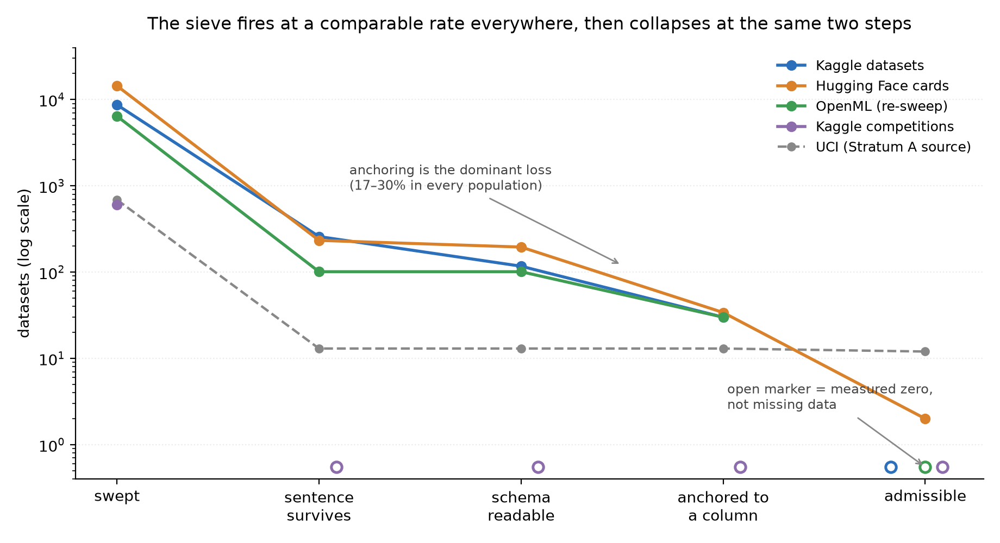
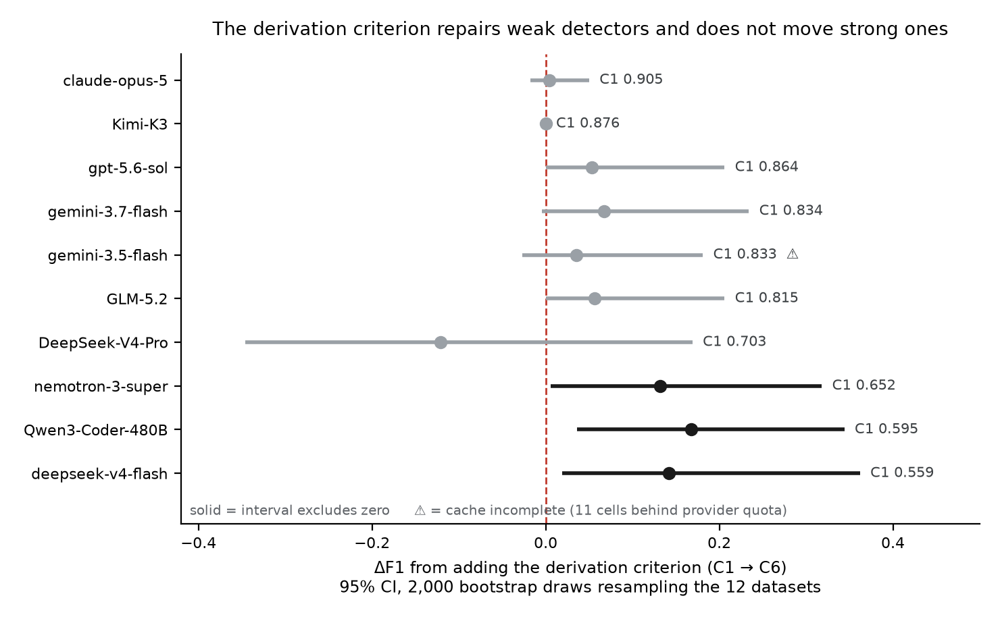

# Detecting Feature-Level Target Leakage with Language Models: A Source-Grounded Benchmark

## Abstract

A column leaks when it could not honestly have been known at the moment a model
is asked to predict. No splitting scheme repairs it, because the column is
wrong in every split. There has been no corpus to measure detection against.

We build one: **604 columns across 15 datasets, 68 documented positives**, each
licensed by a written record and most by a verbatim quotation from the dataset's
own documentation. Two strata are admitted under different rules and never
pooled — **12 datasets and 40 positives** coded from documentation, and a
held-out **3 datasets and 28 positives** whose sources name the leaking column
themselves — with a third stratum of external validation and a fourth of
mechanically verified positives. Every coded derivation implying a testable
pattern is checked against the values, and one source statement is refuted by
its own data and withdrawn.

On this benchmark the best model reading only column names and a target reaches
**F1 0.905**, and the best figure anywhere on the condition ladder is **0.929**
— against **0.630** for a correlation baseline whose threshold was swept on the
answers, and **0.394** for a keyword rule over column names whose vocabulary was
fitted the same way. The failure is definitional rather than statistical: mean
recall is 98% on TIMING, 84% on CONSEQUENCE, and 61% on REASON — columns
recording *why* a label was assigned — and one sentence naming that criterion
lifts REASON to **86%**, closing a 23-point gap to three points. That
intervention is not free money: measured in F1 rather than subtype recall it
**concentrates in the weak detectors**, and for the three strongest models a
cluster bootstrap over datasets is consistent with no effect at all. Cleaning a
dataset with a model's flags lands **0.024 F1** from the ceiling a documented
cleaning achieves; the baseline lands 0.048 away and errs in both directions.
Leaving the documented columns in inflates F1 by **0.147** on average.

Sweeping 7,109 archive records plus 8,693 Kaggle datasets, 605 competitions and
14,420 Hugging Face cards, the sieve fires at a comparable rate everywhere and
yields **eight admissible records in total**. Scarcity of *documented* leakage
replicates in every population we can reach. On contamination: no model
reproduced any of 675 data rows or any of 30 headers, and — the stronger
control — both frontier models score *marginally better* with every column,
target and dataset name replaced by a meaning-preserving alias (**−0.019** and
**−0.022** at C6).

Triage is what this supports today, and the number is the contribution: a
model's flags put **48 of 306 columns — 16% — in front of a human reviewer, and
that 16% contains every documented leak** (40 of 40, recall 1.000).

---

## 1. Introduction

A practitioner downloads a table, picks a target, and trains. Some column in
that table records something that could not have been known yet. The model
scores well, ships, and fails.

This is **feature-level target leakage**, and it is not the leakage most tooling
targets. Overlap between train and test is procedural: the code is wrong, and
reading the code finds it. Here the pipeline is correct — the column is split
cleanly, scaled after the split, used once. What is wrong is what the column
*means*, and that lives in the documentation rather than the program.

Kaufman et al. (2012) gave the phenomenon its modern definition and proposed
learn–predict separation as the discipline. That work is about avoiding leakage
in data you collected. Detecting it in data somebody else published is a
different problem, and it has had no evaluand: no column-level labels, no
corpus, nothing to score a detector against.

**Three contributions.**

**(1) A benchmark.** 604 columns, 68 positives, each licensed by a written
record and audited against it (§4.4). Two strata, reported separately, because
the difference between "a source names this column" and "we read a source's
description" is a property of the labels and not something to average away.

**(2) Evidence that models detect what correlation cannot, on public and on
unseen data alike.** Best F1 0.929 against a tuned upper-bound baseline at
0.630, and exact performance at the primary condition on the held-out set.
Downstream, model-based cleaning recovers the honest ceiling to within 0.024 F1
while the baseline misses in both directions — keeping a leak on one dataset and
deleting the most useful legitimate feature on another. On twenty tables
generated locally and never published, 12 of 16 models exceed the same baseline
at the primary condition and 14 of 16 with the derivation clause — the same
counts as on the public corpus — though best F1 falls from 0.929 to 0.852.

**(3) A measurement of why they fail, and how little it takes to fix.** Models
solve leakage-as-timing before we intervene and miss leakage-as-derivation. One
sentence naming the second criterion closes almost the whole gap. The predicate
practitioners need — *is using this value legitimate?* — has no temporal
definition, and every result here follows from that.

We also report what the benchmark cost to build. Documented leakage is
**scarce**: across 7,109 archive records the frozen instruments surfaced six
admissible statements, and the rate replicates across four documentation
cultures. That scarcity is why no supervised detector exists, and why the
instrument measured here is one never trained on the task.

---

## 2. Scope and mechanisms

**Definition.** A column is inadmissible for a target if its value could not
honestly have been obtained at the **prediction point** — the moment the model
is asked to answer. Leakage is a property of the triple (column, target,
prediction point), never of a column alone. The same column is admissible under
one prediction point and not another, and §6.4 demonstrates this twice.

**Four mechanisms**, cut for codability against a written source rather than for
coverage:

| mechanism | the column… | example |
|---|---|---|
| **REASON** | was an input used to assign the label | `TWF`/`HDF`/`PWF`/`OSF` → `Machine failure` |
| **CONSEQUENCE** | exists *because* the outcome occurred | `body` (body recovery number) → `survived` |
| **TIMING** | is recorded after the prediction point | 1995 crime counts → a 1995 rate predicted from a 1990 census |
| **UPSTREAM** | was computed by a process that consumed outcome information | declared; not separately measured |

A prior estimate of the same target is *not* a fifth mechanism. Such columns —
SUPPORT2's `prg2m`/`prg6m`, STUDENT's `G1`/`G2` — are strong predictors, but the
sources place their values at or before the prediction point, so they are coded
**legitimate** (§4.4). A prior estimate that is available when the prediction is
made is an ordinary feature, however predictive. Condition C7 tests whether
telling a model otherwise changes its behaviour.

**Out of scope**: train/test contamination, group leakage, benchmark
contamination, and external leakage. These are procedural or evaluation-level
and are already served by existing tooling.

---

## 3. Related work

**The formulation, and what it left unbuilt.** Kaufman, Rosset, Perlich and
Stitelman (2012) defined leakage in terms of *legitimacy* — a feature is
legitimate if it is available at the prediction point. They supply the
definition we adopt and no corpus against which a detector could be scored,
because scoring one was not their problem.

**Scale.** Kapoor and Narayanan (2023) surveyed leakage across 17 fields and 294
affected papers. Their taxonomy's **L2 — "model uses features that are not
legitimate"** — is exactly our object, and it is the one type they decline to
decompose: their other categories carry sub-types, and the reason they give is
that judging a feature's legitimacy requires domain knowledge and is specific to
the problem. §2's four mechanisms are sub-categories of L2, and §4's protocol is
an attempt to make the judgment turn on a written source rather than on the
coder's domain knowledge. Their remedy for L2 is expert review of the feature
set; ours does not replace it — §9 argues the defensible product is triage,
putting **48 of 306 columns, 16%,** in front of that expert instead of all of
them. Field-level studies reach the same conclusion independently: Roberts et
al. (2021) identified 2,212 COVID-19 imaging studies, reviewed 61 in depth,
and found none of those clinically
usable.

**What existing tooling targets.** TFX data validation (Breck et al., 2019) and
Deequ (Schelter et al., 2018) express constraints over *values*. Neither
expresses a constraint over a column's relationship to a target, because that
relationship is not a property of the data — a column of integers is legitimate
or not depending on when it was written down. LeakageDetector (ICSME 2025)
detects overlap, preprocessing and multi-test leakage: all three procedural, all
three findable by reading the code.

**LLMs over tabular schemas, and the contamination risk.** Language models have
been applied to tabular tasks that are semantic rather than statistical
(Narayan et al., 2022; Hegselmann et al., 2023). The direct threat to that
reading is Bordt et al. (2024), who show that models have memorised many popular
tabular datasets, with contamination concentrating in datasets with meaningful
column names — precisely our setting. We run their released checker and a
renaming control of our own (§6.3).

**Two qualifications.** The term is overloaded: most recent work labelled
"leakage benchmark" concerns *benchmark contamination*, a different object
excluded in §2; and a third literature uses "leakage" for water escaping from
pipes. Separately, Larsen and Becker (2021, ch. 24) give seven types of target
leakage under a deliberately expansive definition; only their **type 1** is our
object, and our four mechanisms refine it. A full mapping is in Appendix J.

---

## 4. The benchmark

### 4.1 Evidence protocol

A column enters as a positive only through a written record fixing six things:
target, prediction point, mechanism, source citation and locator, a verbatim
quotation, and coder and date. A candidate that cannot fill all six is rejected
rather than argued about; 136 were.

**Admissibility tiers** record what kind of statement the evidence is, not how
prestigious its container is. A dataset's own documentation outranks a paper
that merely uses the dataset.

| tier | evidence |
|---|---|
| E1 | the source states the relationship as a fact about the data's construction |
| E2 | the source describes the column in terms that entail the relationship |
| E3 | the relationship follows from the column's documented meaning, and the coder says so explicitly |

**Legitimate by default.** A column with no admissible record is coded
legitimate, whatever the coder suspects. This is asymmetric on purpose: it can
only create false negatives in the ground truth, so a model's measured precision
is a lower bound and its recall is not.

**Verification against the data.** Where a coded mechanism implies a testable
pattern in the values, the pattern is checked. The check does not create the
label — a legitimate column can correlate perfectly by accident — but a coded
derivation the data contradict is withdrawn. One was: AI4I's documentation names
five failure modes as inputs to `Machine failure`, and `RNF` is not one of them
in the table; 1 of its 19 flagged rows carries the target. `RNF` is coded
legitimate **against its own documentation**.

### 4.2 Two strata

**Stratum A** — 12 datasets, 306 columns, 40 positives, coded from
documentation. **Stratum B** — 3 datasets, 298 columns, 28 positives, admitted
only where the source *names* the column, which makes it a genuine held-out set:
its selection criterion is independent of anything a model does.

The corpus is concentrated and we report it rather than let a reader discover
it: SUPPORT2 supplies 9 of 40 Stratum-A positives; CRIME supplies 17 of 28
  in Stratum B, 9 of those resting on a single sentence about data vintage.

### 4.3 Scarcity: what it cost to build this

We swept both machine-readable repositories in full — 689 UCI records and 6,420
active OpenML descriptions, 7,109 in total — with a lexical sieve frozen before
the sweep, then hand-read every surviving sentence.

**Frozen-sieve rate: 6 in 7,109 — 0.084%. Corrected rate: 7 in 7,109 —
0.098%.** Both are reported because they answer different questions: the first
is what the instruments as frozen found, and is the number the sieve code in the
artefact bundle produces when re-run; the second is what the archive contains
once a defect in those instruments is repaired. A one-pattern post-hoc extension
adds one more, giving 8 in 7,109 (0.113%).

The three figures stack in one direction only, and every step is a *miss* being
recovered, never a hit withdrawn. All three are lower bounds, and the misses are
the proof: a sieve is a lexical instrument, and authors who do document a
derivation are not obliged to phrase it the way the instrument expects. AI4I
601 — a dataset *inside this benchmark* — states its derivation as a conditional
(*"the 'machine failure' label is set to 1"*) and all three sieve families miss
it. Editing the sieve to catch it and reporting the result as a sieve find would
be fitting the instrument to its answer, so the original is left frozen and the
extension runs beside it. [N §4]

### 4.4 A negative result, and an audit of our own labels

**The closed-world dictionary rule.** If a dataset documents *every* column, then
silence is informative: a column the dictionary does not describe as post-outcome
can be presumed clean. **406 of the archive's 689 datasets meet
that condition**, covering 25,697 columns. Applied to all of them, the rule flags **23 columns — 0.090%** — against a
base rate of 11.3% in this benchmark's hand-coded corpus. On the eleven corpus
datasets in its scope it recovers **8 of 56 positives (14.3%)**. Where it fails
it fails clearly: STEEL's six sibling faults, CRIME's seventeen crime counts and
MI's eleven complications are each described impeccably and individually. What
makes them leak is their relationship to the target, which no per-column
description states. **A complete data dictionary is not documented provenance.**
[N §15]

**The audit.** Fifteen SUPPORT2 positives originally rested on one third-party
sentence naming no column — *"we rigorously excluded surrogate outcomes and
administrative features"* — while the dataset's own variable descriptions sat
unread. Re-reading against the rule that a record must quote a source *about the
column* withdrew **eight of 76 labels**, every one of them a prior estimate of
the target. The
correction is non-uniform: it raises eight of the ten models it could be
computed on — the six Vertex models postdate the withdrawal — and lowers
two, because the withdrawn columns were disproportionately ones models declined
to flag. We state the rule before the effect. What a benchmark owes its users is
not the claim that its labels are beyond dispute, but enough information to
dispute them; the eight withdrawn columns are named in Appendix B with their
quotations.

---

## 5. Experimental setup

Each condition adds exactly one thing to the previous. **C1** — column names and
a target — is the primary condition. **C6** adds a two-clause derivation
criterion naming both reasons a column can be unavailable. **C9** restates that
criterion without reference to time. C0 (names only), C2 (prediction point), C3
(documentation), C4 (five sample rows) and C5 (expert framing) fill the ladder.
Prompts are in Appendix D.

Sixteen models from nine laboratories, in two tiers: a **frontier** tier
(`claude-opus-5` max effort, `gpt-5.6-sol` extra-high, `gemini-3.7-flash`,
`gemini-3.5-flash`, and on Vertex `gemini-3.1-pro-preview`, `gemini-2.5-pro`,
`grok-4.20` and `grok-4.1-fast` each reasoning and non-reasoning)
and a **replication** tier of open weights at
`reasoning_effort: high`. Every condition comparison is **matched on cells**:
C1 and C6 are scored on the (dataset, shuffle) pairs answered under both.
Column order is shuffled per seed, and the spread across shuffles is reported
because it is sometimes larger than the effect (§8).

**2,390** cached in total, of which **462** are paraphrase-arm cells with
aliased column names (§6.3); and **1,886** real-name Stratum A/B cells that
parse, which is the population every detection table is computed on. [N §10, §17]

**Baselines**, all fitted on the answers and therefore upper bounds. B3 is a
correlation threshold whose cut-point is swept on Stratum A (**F1 0.630**). Its
lexical counterpart, **B1-tuned**, is a keyword rule over column names: §4.3's
frozen sieve vocabulary plus 34 name patterns — `days_to_*`, `*_outcome`,
`body`, `discharge_*` and the rest — chosen by looking at which columns leak
here. It reaches **F1 0.394** on Stratum A, and **0.000** on Stratum B, which is
a true out-of-sample test because no pattern came from a Stratum B column. The
rule that recovers 14 of 40 positives on one stratum recovers 0 of 28 on the
other, where `gpt-5.6-sol` at C1 is exact: leaking column names share no
vocabulary that transfers between datasets. If the models were matching a
learned vocabulary of leaky names, the rule encoding exactly that vocabulary
would not score zero where they score one. [N §5]

---

## 6. Results

### 6.1 Detection

**Frontier tier.**

| model | cond | P | R | **F1** | ds | sd |
|---|---|---|---|---|---|---|
| **gpt-5.6-sol xhigh** | C1 | 0.854 | 0.875 | 0.864 | 12 | 1 |
| | **C6** | 0.867 | 0.975 | **0.918** | 12 | 1 |
| claude-opus-5 max | C1 | 0.864 | 0.950 | 0.905 | 12 | 1 |
| | **C6** | 0.833 | **1.000** | **0.909** | 12 | 1 |
| gemini-3.7-flash | C1 | 0.840 | 0.829 | 0.834 | 12 | 5 |
| | **C6** | 0.867 | 0.938 | **0.901** | 12 | 5 |
| gemini-3.5-flash †| C1 | 0.818 | 0.858 | 0.837 | 12 | 5 |
| | C6 | 0.811 | 0.940 | 0.871 | 12 | 5 |
| **B3 upper bound** | | 0.697 | 0.575 | **0.630** | 12 | — |

† `gemini-3.5-flash`'s figures are **provisional wherever they appear** — every
table in this paper, not only this one. Of eleven cells quarantined for
truncation, **eight are still missing**: KOI at C1, C2 and C7 — and C9 on the
Vertex arm — LC at C1 and C6,
and STUDENT at C1 and C6. The cause is an instrument interaction rather than our
token budget, and it is prompt-specific, so the loss is not random with respect
to dataset (§8). Rows carrying this marker are computed over the shuffles that
returned, and should not be read as like-for-like against the unmarked rows.

**Replication tier** (open weights, `reasoning_effort: high`).

| model | cond | P | R | F1 | ds | sd |
|---|---|---|---|---|---|---|
| Kimi-K3 | C1 | 0.796 | 0.975 | 0.876 | 12 | 1 |
| | C6 | 0.796 | 0.975 | 0.876 | 12 | 1 |
| GLM-5.2 | C1 | 0.805 | 0.825 | 0.815 | 12 | 1 |
| | C6 | 0.822 | 0.925 | 0.871 | 12 | 1 |
| nemotron-3-super | C1 | 0.682 | 0.625 | 0.652 | 12 | 3 |
| | C6 | 0.741 | 0.833 | 0.784 | 12 | 3 |
| Qwen3-Coder-480B | C1 | 0.502 | 0.730 | 0.595 | 12 | 5 |
| | C6 | 0.646 | 0.930 | 0.762 | 12 | 5 |
| DeepSeek-V4-Pro | C1 | 0.627 | 0.800 | 0.703 | 10 | 1 |
| | C6 | 0.457 | 0.800 | 0.582 | 10 | 1 |
| deepseek-v4-flash | C1 | 0.621 | 0.509 | 0.559 | 12 | 3 |
| | C6 | 0.704 | 0.698 | 0.701 | 12 | 3 |

Reading column names beats a correlation threshold fitted on the answers by
**+0.288 F1** for the best frontier model. **14 of 16 models exceed the
baseline at C6** — the exception is `DeepSeek-V4-Pro`, which gets worse under
the clause (§7) — and twelve of 16 already exceed it at C1 with only the
column names, the target, and no documentation of any kind.

The gap between tiers is a ceiling effect rather than a capability gap: **+0.063 mean
gain in the replication tier against +0.083 in the frontier tier, and the
replication figure is itself dragged by the one model that gets *worse* at C6;
excluding it the tier mean is **+0.100**. `claude-opus-5` enters C1 at F1 0.905
with recall 0.950, so a documentation clause has almost nothing left to add;
§6.2 measures the effect where the ceiling does not hide it. The tiers are a
division of provenance and not a ranking — `Kimi-K3` scores 0.876 from C1 with
no clause at all, above six of the ten frontier models.

**One positive is nearly free, and we mark it.** ECHO's `still_alive` implies the
target on 45 of 45 rows — a second copy rather than a leaking feature. It is a
real column a practitioner would find, so we keep it, but every model flags it.
Recoding it legitimate costs each model **0.007–0.021 F1** and moves the best C6
figure **0.929 → 0.916**; the ordering is unchanged and no claim turns on it.
[N §23]

**On the held-out set, `gpt-5.6-sol` at C1 is exact** — 84 true positives, zero
false positives, zero false negatives across 894 column judgments, three
shuffles of 298 columns, from names and a target alone. This is the paper's most
quotable number and its least reproducible: `gpt-5.6-sol` and `claude-opus-5`
have no API key in our environment, so every one of their cells was obtained by
hand through a chat interface with the prompt hash-matched to the API runs. A
reader cannot re-run them, and the effort settings are vendor labels rather than
versioned artefacts. We report it as what a frontier model did on a given day.

It is tempting to read the exactness as an independent audit of the ground
truth. We do not, because it is circular in the direction that flatters us: the
model is one of the systems under evaluation. The non-circular reading is that
labels and model may share a common cause — Stratum B's positives are named by
their sources in ordinary technical English, and a model trained on that English
reads them as a coder does. Exact agreement is evidence that **Stratum B is
lexically easy**, not that the coding is correct.

### 6.2 The failure is definitional

| model | REASON C1 → C6 | CONSEQUENCE C1 → C6 | TIMING C1 → C6 |
|---|---|---|---|
| gpt-5.6-sol | 71% → **100%** | 95% → 95% | 100% → 100% |
| claude-opus-5 | 100% → 100% | 89% → 100% | 100% → 100% |
| gemini-3.7 | 62% → **100%** | 89% → 89% | 100% → 100% |
| gemini-3.5 †| 74% → **97%** | 89% → 89% | 100% → 100% |
| Kimi-K3 | 100% → 100% | 95% → 95% | 100% → 100% |
| GLM-5.2 | 71% → **100%** | 84% → 84% | 100% → 100% |
| Qwen3-480B | 46% → **100%** | 85% → 92% | 92% → 84% |
| nemotron-3-super | 38% → **86%** | 68% → 75% | 93% → 100% |
| DeepSeek-V4-Pro | 71% → **57%** | 79% → 89% | 100% → 100% |
| deepseek-v4-flash | 0% → **45%** | 79% → 77% | 80% → 100% |
| **mean, complete rosters** | **62% → 88%** | 85% → 88% | 96% → 98% |

**At C1, with no intervention, mean recall is 98% on TIMING, 84% on
CONSEQUENCE, and 61% on REASON.** **13 of 15** models score REASON below
their own CONSEQUENCE recall in the same cells. Naming the second criterion
lifts REASON to **86%** — closing a 23-point gap to **3.0 points** — and moves
the other two subtypes by under 4.

*Every subtype figure is a **mean over models** over **complete rosters**: the
nine models with no missing cell, matched C1 against C6, rounded. A per-model
row is a per-model claim and is honest about the cells it rests on; a mean over
models treats each row as one comparable unit, and a row missing cells
non-randomly is not one — so `gemini-3.5-flash` appears in the table above and
in no aggregate (§8). Including it moves nothing by more than a point (63%, 85%,
97%; lift to 89%), and column-pooling gives materially different numbers again,
which is why the convention is stated rather than left to be inferred.* [N §24]

**Models solve leakage-as-timing before we intervene.** That is the paper's
thesis in one line: practitioners think of leakage as timing, the models already
have timing, and what they lack is the second criterion — that a column can be
inadmissible because the label was *derived from it*, whenever it was recorded.

**How much of this depends on the coding?** The subtype partition is one coder's
reading, and 33 of the 40 Stratum-A positives sit on the REASON/CONSEQUENCE
boundary. Relabelling a fifth of that boundary at random leaves the C1→C6 lift
margin clearly positive (+1.0 to +20.4 over 2,000 draws) while the C1 level gap
already spans zero. An adversary allowed to choose which labels to overturn cuts
the margin to 1.2 with three flips — but the three it picks are KOI's
`koi_fpflag_*` columns, the vetting decisions that produce `koi_disposition`,
each carrying a data check and about as disputable as arithmetic. Restricted to
the 22 tier-E3 positives, the only genuinely arguable ones, the margin holds at
**+5.5 with half of them overturned in the worst direction**. The *direction* is
not an artefact of the coding; the *magnitude* should not be read to a decimal.
[N §21]

### 6.3 It is not memorisation

Every Stratum-A table is a well-known public dataset. We test five ways.

**Direct reproduction.** Running Bordt et al.'s released `tabmemcheck` over four
models and all fifteen tables: **no model reproduced any of 675 data rows or any
of 30 headers.** What they emit is a well-formed forgery — right schema, right
units, plausible ranges, wrong values.

**Column names are recalled, and that is the honest half.** Across four models,
19% to 61% of *leaking* column names are completed from a partial schema. Ten of
twelve Stratum-A datasets have at least one leaking column recalled by some
model, which is why we do not report a leave-recalled-out rescoring: run
honestly it has one usable dataset, and we say it cannot be computed rather than
compute it on the subset that flatters us. [N §16]

**The renaming control.** Every column, target and dataset name is replaced by a
meaning-preserving, string-distinct alias, with transparency level preserved —
an opaque acronym maps to a different opaque acronym. At C6, the condition the
headline rests on, `claude-opus-5` scores **−0.019** and `gpt-5.6-sol`
**−0.022**: both marginally *better* with every column renamed. Across 44 live
cells from eight models the median cost is 0.053; `Qwen3-Coder-480B` is the one
model that genuinely depends on the strings, losing 0.759 F1 at C5. [N §11]

**A post-cutoff table.** ChessFraud (§6.4) was published in 2026, after most of
the roster's training data, and models with no possible exposure recover
`assistance_line_rank`, whose missingness alone reproduces the label.

A further reassurance is behavioural. `gpt-5.6-sol` at C1 abstained on **all
40** KOI columns — *"the deployment prediction point is unspecified"* — and
flagged all four `koi_fpflag_*` correctly at C6, its abstentions falling from 83
to 38. Refusal contingent on the prediction point is not what a memorised answer
key produces. [N §6]

**Twenty tables that have never been published.** The controls above all run on
public data, so none of them separates reasoning from recall of the *discussion*
of a table — no renaming defends against that, because the reasoning survives
renaming exactly as the honest capability does. So we generated twenty tables
locally from a committed generator at a fixed seed: **840 columns, 120 injected
positives — 40 REASON, 40 CONSEQUENCE, 40 TIMING** — leaks injected by rule and
verified on 100% of rows, published nowhere until every run finished. A table
that has never left the machine has no discussion to memorise.

The analysis plan, fixed before any table existed, names the subtype asymmetries
rather than F1 as the dependent variables, because a fall in F1 on generated
tables is equally well explained by the generator. On the full sixteen-model
roster the C1 deficit is **+33.0** points (95% CI [+17.1, +49.6]) against the
real corpus's +23.2, and the one-sentence repair is **+22.0** against +24.8.
All sixteen models show a positive deficit. **The definitional finding
replicates, and is larger on tables no model can have seen.** Detection above
the correlation baseline survives too: 12 of 16 models beat it at C1 and 14 of
16 at C6, the identical counts to the public corpus.

What does not transfer is absolute quality — best F1 falls 0.929 → 0.852 — and
a model's standing on the public corpus carries almost no information about its
standing here: **corr(public, unseen) = +0.054, p = 0.84** at the primary
condition, with the between-model spread collapsing from sd 0.145 to **0.046**
(Levene p = 0.014). Sixteen models spanning 0.48 F1 publicly converge into a
band 0.14 wide. Replacing every
column name with `col_1…col_n` produces near-universal abstention rather than
guessing: 1,816 of 1,836 judgments across three models, the models stating that
an anonymised name gives them nothing to reason from. Part of the public-corpus
*advantage* looks like recall; the definitional structure does not.

### 6.4 Does the result depend on where we looked?

The instruments were written on archive prose. **Stratum C** applies them to
four documentation cultures that are not that: **8,693 Kaggle datasets, 605
competitions, 14,420 Hugging Face cards and 6,418 OpenML records.**

**Figure 1.** The funnel collapses in every population at the same two steps.
Log axis; an admissible-zero is drawn as an open marker at the floor, because an
absent bar and a zero bar must not look the same.

**The trigger rate transfers; the precision does not.** The sieve fires on
1.5–1.6% of datasets after exclusions against 1.9% of UCI. **Anchoring, not
triggering, is the dominant loss**: only **17–30%** of surviving sentences
attach to a named column, because listings rarely expose a schema. Elsewhere the
surviving sentences are about markets, soil cores, revenue and training-set
hygiene rather than columns. **The Kaggle arm yields no admissible record at
all** — zero across 8,693 enriched datasets and zero across 605 competitions.

Two records survive, and they make opposite points.

| record | documented? | detected? | ΔF1 |
|---|---|---|---|
| **ChessFraud** (Kaggle, 2026) | yes, by the uploader | — (left uncoded) | **0.632** |
| **Klaverjas2018** (OpenML) | yes — *"should not be used as predictors"* | 3 of 4 models miss both columns | **−0.003** |

**Klaverjas is the paper's cleanest single case.** Its documentation says
plainly that two columns should not be used; almost every model misses them; and
removing them *improves* F1 by 0.003. Documented, undetected, and inert — three
properties that a single quality score would collapse. It is why detection and
downstream cost are reported on separate axes throughout.

**Leakage needs a target, demonstrated twice.** The same Bike Sharing table is
documented as leakage on Hugging Face and not on UCI; `casual + registered ==
cnt` exactly on all 17,379 rows either way. What differs is not the data but
whether somebody wrote it down.

**A hard case the sieve cannot reach, and the paper's clearest negative
result.** Cirrhosis (UCI 878, Mayo Clinic PBC trial) documents `N_Days` as *"the
number of days between registration and the earlier of death, transplantation,
or study analysis time"* — an interval whose endpoint is the target event.
Dropping it costs 0.051 F1. The frozen sieve returns **zero** surviving
sentences on the entire record: no warning verb, no derivation verb, nothing a
regular expression can catch. Ten models were run on it, the Stratum C roster,
which contains no frontier model. **Four of the ten flag `N_Days` at C1, all
four with zero false positives out of seventeen**; at C6 six flag it, but false
positives rise from 14 to 20 across the roster. Only `nemotron-3-super` is exact
at both conditions; three models trade one condition for the other rather than
improving. A leak this legible to a human is found by fewer than half the roster
at the primary condition and by no model reliably across conditions. Acting on
the flags still recovers most of what an oracle recovers (mean **+0.038** against
the oracle's +0.065, 14 of 20 cells positive), and several cells reproduce the
oracle exactly. Because cirrhosis is hand-nominated rather than sieve-found it is
**excluded from every yield denominator** and reported as a diagnostic.

**Stratum D: positives that need no coder.** Sweeping the 177 UCI records with a
machine-designated target for rules holding on *every* row — identity, subset
sum, logical OR, functional mapping, missingness — yields eight records at
agreement 1.000, four of them new. A second coder cannot disagree with a
crosstab.

| UCI | target ← column | rule | *n* | ΔF1 |
|---|---|---|---|---|
| 887 | `age_group` ← `RIDAGEYR` | `≥ 65` | 2,278 | **+0.596** |
| 419 | `class` ← `result` | AQ-10 `≥ 7` | 292 | +0.086 |
| 426 | `class` ← `result` | AQ-10 `≥ 7` | 704 | +0.073 |
| 857 | `class` ← `affected` | 1:1 relabelling | 200 | **+0.014** |

Admission needs more than an exact rule: two of the eight hits have a leaking
column that UCI itself marks `Target`. Predicting one designated outcome from
another is not this paper's failure mode, so **MI is excluded** — it carries
twelve targets, and admitting one pair would license 132. The same principle
leaves ChessFraud's `is_cheating_player_game` uncoded: *a column that is itself
an outcome is not a feature.* STEEL is kept and the fact disclosed, because
there a modeller really does pick `Other_Faults` as the label with the other six
fault columns in the frame.

Scoring the role field as a detector is a second reproduction of §4.4's negative
result: *"refuse any column the archive marks `Target`"* catches **2 of 8** and
misses every record where the leak is a genuine feature. None of the four new
records is documented as leakage — `RIDAGEYR` is *"Respondent's Age"* and
`age_group` is *"Respondent's Age Group"*, both accurate, neither saying one
determines the other. And the consequence spread at *identical* evidential
status runs from **+0.014 to +0.596**, a factor of forty. [N §20]

### 6.5 How much would survive a different corpus

Columns are not independent draws — CRIME contributes 144 of them and 17
positives, nine resting on one sentence. We resample **datasets**, 2,000 draws,
and pair it with McNemar's exact test on the per-column decisions.

**Figure 2.** Every interval that excludes zero belongs to a model scoring under
0.66 at C1; the three strongest are consistent with no effect.

**The derivation criterion repairs weak detectors and does not move strong
ones.** `claude-opus-5` moves +0.004 with two columns going each way and
`Kimi-K3` not at all, while Qwen (+0.168), deepseek-v4-flash (+0.142) and
nemotron (+0.132) all have intervals excluding zero. `DeepSeek-V4-Pro` is
significantly *worse* at C6 (−0.121, p = 0.009). A twelve-cluster corpus cannot
support narrow intervals, and we would rather print wide ones than pick a
resampling unit that flatters us. [N §19]

---

## 7. What the leakage costs, and what the interventions cost

**Downstream.** For each dataset we train a random forest three ways: keeping
everything, dropping the coded positives (the honest ceiling), and dropping what
a model flagged.

| arm | mean residual F1 | mean \|residual\| |
|---|---|---|
| ALL (do nothing) | +0.147 | 0.147 |
| claude-opus-5 | −0.024 | **0.024** |
| gpt-5.6-sol | −0.024 | **0.024** |
| B3 baseline | −0.024 | **0.048** |

Leaving the documented columns in inflates F1 by **0.147** on average and 0.306
at worst. **B3 matches on the mean by cancellation** — its absolute error is
twice as large, because it under-drops on some datasets and over-drops on
others. TITANIC is the clearest case: B3 drops `sex` (|r| = 0.529, entirely
legitimate and the most useful feature on the table) and keeps `body`
(|r| = 0.014), a number that exists only for passengers who did not survive. A
correlation threshold cannot separate *correlated because it caused the label*
from *correlated because it predicts the label*, and it cannot see a leak that
is not correlated at all.

**Over-flagging has a measurable cost.** On ECHO — 131 rows — all five measured
models drop two columns where the truth drops one, and F1 falls to 0.407 against
the documented cleaning's 0.677. We call that 0.677 a benchmark rather than a
ceiling because keeping every column scores 0.684 under the same learner: ECHO
is a second documented-inert case, and under gradient boosting the sign flips.

**The intervention is brittle in both directions.** C9 restates C6's criterion
without reference to time, and the two wordings fail in mirror image.
DeepSeek-V4-Pro flags all six of STEEL's sibling faults at C1 and un-flags all
six at C6 with the identical stated reason — **"measured concurrently"** — and
recovers 6/6 under C9, reasoning *"true label for another fault type."* But C9
has no brake: on AI4I, `gpt-5.6-sol` flagged **all ten columns**, reasoning that
each is *"an input to the synthetic rules that determine Machine failure."* True,
and useless.

| model | F1 C6 | F1 C9 | Δ |
|---|---|---|---|
| DeepSeek-V4-Pro | 0.582 | **0.772** | **+0.190** |
| claude-opus-5 | 0.909 | **0.929** | +0.020 |
| Kimi-K3 | 0.882 | **0.896** | +0.014 |
| deepseek-v4-flash | 0.711 | 0.711 | 0.000 |
| GLM-5.2 | **0.871** | 0.860 | −0.011 |
| nemotron-3-super | **0.690** | 0.654 | −0.036 |
| gpt-5.6-sol | **0.918** | 0.857 | −0.061 |

**No wording of the derivation criterion is uniformly better, and we can name
the failure mode of each.** Prompt-level interventions for this task require
per-deployment validation, which no current practice provides. [N §6]

---

## 8. Limitations

* **`gemini-3.5-flash`'s figures are provisional, and the cause is not what we
  first recorded.** Eleven cells were quarantined as truncated and attributed to
  our own token budget. That attribution was wrong: at `temperature=0.0` this
  model intermittently returns `finish_reason = "length"` after a few hundred
  visible tokens *whatever* `max_tokens` is — 12 of 40 columns at a
  16,000-token budget on KOI, while removing the temperature field alone returns
  all 40. It is prompt-specific, not a size limit. We refilled what retrying at
  the **unchanged** temperature recovered rather than dropping the parameter,
  because a cell run at a different temperature is not comparable with the 1,800
  it is pooled against. **Eight remain missing** — KOI at C1, C2 and C7, LC at
  C1 and C6, STUDENT at C1 and C6, and KOI at C9 on the Vertex arm — and every table row computed from this model
  carries a † for that reason. This is the paper's own thesis arriving in its own
  methods section: an instrument interaction that presents as a model property.
* **Two cells are refused rather than scored**, and both are format failures —
  a model returning a single column named `Pstatus,paid,etc...`, and another
  returning the literal placeholder `<column>`.
* **Precision is a lower bound** (§4.1), and **the subtype codes are one coder's
  partition** (§6.2 measures how much that matters).
* **Most models have one shuffle on Stratum A.** Given a measured spread up to
  0.380 between shuffles, single-shuffle figures should not be read to three
  decimals.
* **Re-identification is not fully excluded**, though it is bounded from two
  sides: no model reproduced any of 675 rows or 30 headers, and ChessFraud is
  post-cutoff. One post-cutoff record is not a post-cutoff corpus.
* **Stratum C's detection roster is not §5's**, contains no frontier model, and
  its numbers are lower bounds never pooled with a main-corpus figure.
* **Tabular only.** Nothing here addresses joint leakage across column pairs, or
  a plausibly-named column silently backfilled from the outcome.

---

## 9. Discussion

**Availability is not admissibility.** A model asked "is this value available at
time *t*?" answers correctly and unhelpfully whenever the user's real question is
"is using this value legitimate?". The second predicate has no temporal
definition, and every result here follows from that gap: TIMING is solved before
we intervene, REASON yields to one sentence, and which wording helps depends on
which side of the gap a model already stands. Prior estimates of the target are
the same gap seen from the other side — a physician's survival estimate is
*available* and arguably *inadmissible*, and we could not license the second half
from any source, which is why those columns are coded legitimate. That we could
not license it is the paper's thesis happening to the paper.

**Why no such tool exists, and why that is not an oversight.** A supervised
detector needs a corpus, and the corpus is not there to be collected: **six
admissible records in 7,109** archive descriptions, replicated across four
documentation cultures. At that density you cannot assemble a training set by
sweeping, and the labels are not in the values, so you cannot bootstrap one from
the data either. That is the argument for a reader rather than a classifier, and
why the instrument measured here was never trained on the task. It also explains
what existing tooling *does* target: group leakage and contamination are
documented, mechanically checkable, and have a vocabulary.

**What a detector should be.** Not an autonomous deleter. Precision is a lower
bound, the apparent false positives include probable undocumented true
positives, and the subtype assignment is one coder's reading. The defensible
product is **triage**: `claude-opus-5` at C6 asks a reviewer to look at **48 of 306
columns — 16% — and that 16% contains every documented leak** (40 of 40,
recall 1.000). Across all sixteen models the burden sits between 9% and 24%. [N §14]

**What we would build next.** The instruments here read prose, so §4.3 shows
that leakage is rarely *documented* — not that it is rare. Stratum D's exact
rules are a first step at the other question, and sweeping values rather than
sentences at archive scale would separate the two claims. That is the experiment
this paper makes possible and does not run.

---

## 10. Conclusion

Language models reading column names and a target detect feature-level target
leakage at F1 0.929 against 0.630 for a correlation baseline tuned on the
answers, and are exact at the primary condition on a held-out set whose labels
their sources name. Removing what they flag recovers the honest downstream
ceiling to within 0.024 F1. The failure that remains is definitional rather than
statistical, and one sentence closes most of it.

The benchmark is small because documented leakage is scarce, and the scarcity is
itself the finding: eight admissible records in 7,109 archive descriptions,
replicated in four documentation cultures. Everything here is regenerated from
the artefact bundle by `verify_paper.py`, and the checks that failed are
reported beside the ones that did not.

---

## Appendices

Supplied as a single companion document, generated from the run artefacts.
**A.** Evidence protocol, tiers, attrition, and the coded derivations checked
against the data. **B.** All 68 records with verbatim quotations. **C.**
Prediction points. **D.** Verbatim prompts and run dates. **E.** Paraphrase map.
**F.** `NUMBERS.txt` in full. **G.** The repository sweep, every surviving
sentence and its hand reading. **H.** Downstream protocol and confusion
matrices. **I.** Source code. **J.** Larsen & Becker's seven types, mapped.
**K.** Kaggle datasets excluded as re-uploads. **L.** A reproducible
`temperature=0.0` truncation in `gemini-3.5-flash`: the diagnosis, the failed
attributions that preceded it, and the seven cells it cost us.
