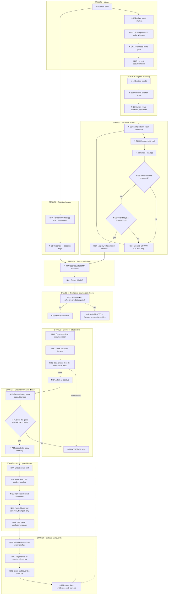

# Leakage Vetting Pipeline — end-to-end design (v2)

*Detects **feature-level target leakage**: a column whose value encodes the
outcome it is used to predict. Not split leakage, not train/test
contamination, not identifier artefacts — those are different failures with
different fixes, and a tool that conflates them will mislead.*

**What v2 changed.** The SURROGATE stage is gone: the category could not be
licensed by any source we could find, and we withdrew it (Stage 5 now does
something more useful). A ground-truth audit stage was added. Every comparison
is now matched, every artefact is freshness-checked, and the sieve is frozen.
Most of the new material is failure modes — the things that silently produce a
wrong answer while looking like they worked.

---

## Design rules

These are load-bearing. Skipping one produces a pipeline that runs and lies.

1. **Leakage is a property of the triple (column, target, prediction point).**
   Not of a column. `discharge_disposition_id` leaks against 30-day
   readmission and is an ordinary covariate against length of stay. Any node
   that judges a column without both other elements is answering a different
   question.
2. **The prediction point must be supplied by a human.** It is not in the
   data, not in the schema, and not derivable. This is the one input the
   pipeline cannot compute.
3. **Legitimate by default.** No admissible evidence → not a positive. This
   is asymmetric on purpose: it produces false negatives in ground truth,
   never false positives, so measured precision is a lower bound.
4. **Predictiveness is not leakage.** A column can be near-perfectly
   predictive and entirely legitimate (`sex` → `survived`), or a genuine leak
   with correlation 0.014 (`body` → `survived`). Any correlation-threshold
   node is a baseline, never an oracle.
5. **Never let "blocked" look like "found nothing".** A rate-limited API, an
   empty field, a failed parse and a genuine zero must be distinguishable in
   every log line and every counter.
6. **Freeze the instrument before you read the results.** If you widen a
   sieve after seeing what it missed, run the widened one *beside* the
   original and report both.

---

## The flowchart

---

## Node reference

### STAGE 0 — Intake

**N-01 · Load table.** Read schema and rows. Record `n`, column count, dtypes.
Do not impute, do not drop, do not encode yet — the pipeline judges the table
as shipped.

**N-02 · Declare target — human input.** Which column is being predicted.
Also record the *positive class* if binary, because "predicting death" and
"predicting survival" produce different leakage sets for the same table.

**N-03 · Declare prediction point — human input.** A sentence: *"at hospital
discharge, before any readmission could occur"*, *"at the COMPAS screening
date, before any subsequent arrest"*. **This is the input nothing can
compute.** Write it before looking at columns, or you will write it to justify
the columns you already suspect.

**N-04 · Anonymised-name gate.** If columns are `V1…V57`, stop. The semantic
screen has nothing to read and will produce confident noise. Report
`INSUFFICIENT_SEMANTICS` and fall through to Stage 3 only.

**N-05 · Harvest documentation.** Every text field available: data dictionary,
README, dataset card, the archive's prose fields, the intro paper's abstract.
Store with locators.

> **Failure mode we hit.** Kaggle's dataset-*list* endpoint returns an empty
> `description`. Sieving it scanned titles and 50-character taglines, found 1
> candidate in 1,281 datasets, and would have supported the headline *"Kaggle
> documents leakage 60× less than the archives"* — a finding produced entirely
> by a field that was never populated. **Assert non-empty before you scan, and
> refuse to report a yield from an empty corpus.**

---

### STAGE 1 — Prompt assembly

**N-10 · Context bundle.** Dataset name, column list, target, prediction
point, and the dataset's *own* description — never one you wrote. A
description you author can encode the answer, and then you are measuring your
own hint.

**N-11 · Derivation criterion — the core intervention.** Whole-table prompt,
every column judged, `ABSTAIN` permitted, one-line reason required per column.

The clause that does the work:

> There are two distinct reasons a column can be UNAVAILABLE, and both count:
> **(a) TIMING** — the value does not exist, or is not yet final, at the
> prediction point. **(b) DERIVATION** — the target's value is a function of
> this column's value: the column was an input to the process that assigned
> the target, or the target was computed, defined or decided from it.
>
> Criterion (b) is about INFORMATION, not about time. Do not test (b) by
> asking when the value was measured. Test it by asking: could the target be
> reconstructed, wholly or in part, from this column? If yes, the column is
> UNAVAILABLE whatever its timing — earlier, later, or simultaneous.
>
> Being merely predictive is not sufficient for either.

**Why this clause exists.** Without it, models operationalise leakage as
*timing only*. Measured across ten models from eight labs: mean recall at
baseline is **97% on TIMING, 89% on CONSEQUENCE, and 62% on REASON** —
columns that record *why* the label was assigned. Adding the clause moves
REASON to 81% and leaves the other two flat.

> **Both wordings are brittle, in mirror image.** A version that says *"this
> holds EVEN IF the value was recorded BEFORE the prediction point"* states
> the criterion in temporal vocabulary, and a literal reader concludes a
> *simultaneous* column falls outside it — one model un-flagged all six of a
> dataset's sibling fault columns with the stated reason *"measured
> concurrently."* The version above fixes that and has no brake: on a
> synthetic dataset whose target is a threshold rule over its sensors, a
> frontier model flagged **all ten columns**, reasoning each was "an input to
> the synthetic rules." **Validate the wording per deployment. Neither is
> uniformly better.**

**N-13 · Sample rows — collected, deliberately not sent.** Provenance is not
in the values. We tested this and the test was under-powered — two models were
slightly worse with rows, one substantially better, all single-shuffle — so we
neither claim it helps nor that it hurts. Default to withholding: rows cost
tokens and risk the model reasoning from correlation, which rule 4 forbids.

---

### STAGE 2 — Semantic screen

**N-20 · Shuffle column order.** Per run, k ≥ 3. **Order alone moves F1 by up
to 0.380** between two shuffles of the identical prompt. Single-shuffle
results should not be read to three decimals.

**N-21 · LLM whole-table call.** Whole-table, not per-column: leakage is
relational, judged against a target alongside siblings. Per-column prompting
asks a harder question and hides models that flag half the table.

**N-22 · Parse + salvage.** Strict JSON first, then bracket-matching salvage.

**N-23/24 · Coverage gate — and never cache a failure.** Under 90% of columns
answered → discard and retry. **A failed call must never enter the cache.** A
quota error written to cache becomes a permanent zero-coverage "answer" the
model never gave.

**N-25 · Join gate — new, and it caught a live error.** If the verdict keys do
not intersect the schema, **refuse the cell**. Do not score it. One model
returned a single "column" literally named `Pstatus,paid,etc...`; scored
naively that is 32 false negatives, indistinguishable from a model that looked
and found nothing.

**N-26 · Majority vote across shuffles.** Helps models with high order
variance; does nothing for models that return an identical answer under every
shuffle. Report per-seed spread, not a standard deviation — with k=3 or 5 an
SD implies precision the data does not support.

---

### STAGE 3 — Statistical screen

**N-30/31 · Per-column statistics and threshold.** |correlation|, univariate
AUC, missingness asymmetry, name regex.

This is a **baseline, not a detector**, and the pipeline should say so in its
output. With the threshold swept on the answers — an upper bound no deployment
can achieve — correlation reaches F1 **0.630** against **0.918** for the best
semantic screen. The failure is structural, not tuning:

- On one dataset it drops `recoveries` (|r| = 0.340) and keeps
  `collection_recovery_fee` (|r| = 0.205) — the amount recovered *after
  charge-off*. Still inflated.
- On another it drops `sex` (|r| = 0.529, legitimate, the most useful feature
  on the table) and keeps `body` (|r| = **0.014**) — a body-identification
  number that exists only for passengers who died.

**No threshold finds `body` at any setting that does not also delete `sex`.**

---

### STAGE 4 — Fusion and triage

**N-40/41 · Cross-tabulate and bucket.**

| bucket | LLM | stats | meaning | action |
|---|---|---|---|---|
| A | flag | flag | both agree | high-priority review |
| B | flag | clean | semantic-only — the interesting cell | review; this is where `body` lives |
| C | clean | flag | predictive but legitimate — where `sex` lives | usually dismiss |
| D | clean | clean | no signal | sample only |

**Triage is the product, not auto-deletion.** In our corpus the best
configuration asks a human to look at **48 of 306 columns (16%)** and that 16%
contains **91% of documented leaks**. Across ten models the review burden sits
between 10% and 21%.

> **Ensembling buys less than you'd think.** Two frontier models on the
> held-out set were *nested* — one's flags were a strict subset of the other's
> at three of four conditions — so requiring agreement returned exactly the
> smaller model's answer. They were not making independent errors.

---

### STAGE 5 — Contested-column gate  ✚ *new in v2, replaces the surrogate sweep*

**N-50/51/52.** Before a candidate becomes a positive, ask one question of the
documentation: **does it state the value is fixed at or before the prediction
point?** If yes, the column is `CONTESTED` — surfaced to a human, never
auto-admitted.

This stage exists because v1 got it wrong. We had a fifth mechanism,
SURROGATE — *a prior estimate of the same target* — covering things like a
physician's survival estimate or a prior-period grade. We withdrew it. The
documentation says those values are recorded **at day 3**, which was the
prediction point, and the one source we had said only that predicting without
them is *"more difficult … but much more useful"* — a claim about difficulty,
not admissibility.

There is a real problem here: a model fed a physician's survival estimate
predicts the physician, not the patient. But that is a claim about what a
model is *for*, not about whether a value could honestly be obtained. **A
pipeline should surface it and let a human decide. It should not encode it as
leakage.**

---

### STAGE 6 — Evidence adjudication

**N-60/61 · Quote search and tiering.** A candidate becomes a positive only
with a verbatim quotation naming the column, plus a locator.

| tier | evidence |
|---|---|
| E1 | the source states the relationship as a fact about the data's construction |
| E2 | the source describes the column in terms that entail it |
| E3 | it follows from the documented meaning, and the coder says so |

Source *formality* is not the criterion — an uploader's paragraph outranks a
paper that merely uses the dataset, because the uploader built the column.

**N-62/63/64 · Data check — and be willing to withdraw.** Where a mechanism
implies a testable pattern, test it.

Real example: a dataset's documentation states *"If at least one of the above
failure modes is true … the 'machine failure' label is set to 1"*, naming
**five** columns. In the data, four hold exactly — every flagged row has the
target set. The fifth is set in 19 rows of which **1** carries the target.
**That column is coded legitimate, against its own documentation.**
Source-named ground truth still has to be checked.

---

### STAGE 7 — Ground-truth audit  ✚ *new in v2*

**N-70/71 · Re-read every quote against the label it licenses.** Building the
corpus quote-first makes it *checkable*, not correct. Run this check
explicitly, and run it before you report anything.

Our audit withdrew **8 of 76 labels**. The dominant failure: fifteen positives
in one dataset were all licensed by a single sentence — *"we rigorously
excluded surrogate outcomes and administrative features containing future
information"* — from a third-party paper. **It names no column.** One unnamed
methodological sentence was doing the work of fifteen records, while the
dataset's own variable descriptions sat unread.

**The rule, fixed before the effect is measured:** a column leaves the ground
truth when its own documentation places its value at or before the prediction
point. Not when a model missed it. Not when it looks arguable.

> **Check that the rule wasn't reverse-engineered.** Two columns in the same
> dataset are documented "measured at day 3" and were *already* negatives
> before the audit existed. If your rule only ever fires on columns that
> embarrass you, it is not a rule.

**N-72 · Apply centrally.** Zero the audited columns **inside the bundle
loader**, so scoring, downstream, baselines and the report cannot disagree
about ground truth. A correction applied in one scorer and not another is a
whole class of bug.

---

### STAGE 8 — Impact quantification

**N-80 · Group-aware split.** If a unit repeats (`patient_nbr`, `member_id`),
use grouped folds or you are measuring group leakage instead.

**N-81 · Arms.** `ALL` (everything), `GT` (documented positives removed — the
honest ceiling), one arm per detector, one for the baseline. Arms differ
**only** in which columns are present. No tuning, no per-arm choices.

**N-82 · Memoise identical column sets.** Detectors mostly agree, so arms
collapse: in our run **54 of 96 arm-fits (56%) were refitting identical,
fully-seeded inputs.** On two datasets, eight arms reduced to two distinct
column sets. Key the cache on the retained-column tuple.

**N-83 · Nested threshold selection.** Choose the decision threshold by inner
CV **on the training part of each outer fold only**. A raw 0.5 cut on an
imbalanced target reports an F1 that describes the imbalance, not the
features. Class-weight the learners so the honest ceiling is a real ceiling.

**N-84 · Report ΔF1, ΔAUC and confusion matrices.** ΔF1 and ΔAUC are not
redundant: one dataset shows ΔF1 0.207 against ΔAUC 0.015 — the flags barely
change ranking and massively change the operating point. **An AUC-only
evaluation would have called it clean.** Pool confusion matrices from raw
counts; averaging per-fold rates and back-solving gives a matrix no fold
produced.

> **This test cannot detect leaks your ground truth also missed.** If a leak
> is absent from both the detector's flags and the documented set, both arms
> are inflated identically and the residual is zero. It shows the detector
> agrees with you, not that you are right.

---

### STAGE 9 — Outputs and guards

**N-90 · Freshness guard on every artefact.** Before reporting from any
derived file, compare its mtime against the files that define ground truth.
**Refuse to print rather than print stale numbers.** We were bitten: a
downstream job was killed by a timeout, left an eight-hour-old CSV in place,
and the reporting layer read it and printed plausible, wrong numbers that
parsed cleanly.

**N-91 · Regenerate every reported number from raw artefacts.** One script,
one output file, and the write-up cites that file and nothing else. If a
number is in the report and not in the file, it is unverified.

**N-92 · Claim audit over the write-up.** Extract every prose sentence;
classify each decimal as DIRECT (appears in the numbers file), DERIVED (a
difference of two that do), or UNSOURCED; flag priority claims ("the first…"),
universal quantifiers ("all", "never", "only"), and causal verbs. Not
automatic — a worklist that guarantees no sentence escapes a read.

**N-93 · Report.** Per column: verdict, bucket, evidence tier, quotation,
locator, and the model's stated reason. Per table: review burden, estimated
inflation, and an explicit caveat list.

---

## Two things worth knowing before you scope the hackathon build

**1. Explicit leakage documentation is very rare, and "leakage" is a homonym.**
Two sieves over **7,109 records** (689 UCI + 6,420 OpenML) surfaced **seven**
feature-level target-leakage statements. A separate sweep of 1,281 Kaggle
datasets fired *more* often (3.6% vs 1.9% of datasets) and almost never meant
this: hits were dominated by train/test split warnings, ethical disclaimers on
synthetic medical data, *"claim leakage"* as an insurance term, and the actual
Enron email leak. **Twelve of the 46 Kaggle hits were re-uploads of datasets
already in our corpus** — detect duplicates by column-name overlap, not by
name, because one re-upload shared no substring with the original.

**2. A complete data dictionary is not documented provenance.** Of 689 UCI
datasets, 406 document every column. Applied to all 25,697 of their columns, a
rule that classifies from the description alone flags **23 (0.090%)** against a
12.6% base rate, and recovers **8 of 64** known positives. It works where the
dictionary literally says *"Time taken for platelet recovery"* and fails
everywhere the leak is relational — six sibling fault types, seventeen crime
counts, eleven complications, each described impeccably and individually.

---

## Build order for a hackathon

| # | build | why first |
|---|---|---|
| 1 | N-01→N-03 intake + prediction point | nothing works without the triple |
| 2 | N-10, N-11, N-21, N-22 | the core loop; demo-able alone |
| 3 | N-23/24/25 gates | without these your metrics are fiction |
| 4 | N-30/31 baseline | free, and it's your contrast |
| 5 | N-40/41 triage buckets | the actual product surface |
| 6 | N-90/91 guards | cheap, and they stop you shipping stale numbers |
| 7 | N-80→N-84 downstream | the "so what" — expensive, do last |
| 8 | N-60→N-72 evidence + audit | only if you're building a benchmark, not a tool |

A demo needs 1–5. Stages 6–8 are what turn a tool into a paper.

---

## Citations

**The formulation.** Kaufman, S., Rosset, S., Perlich, C. & Stitelman, O.
(2012). "Leakage in Data Mining: Formulation, Detection, and Avoidance." *ACM
TKDD* 6(4), Article 15. DOI `10.1145/2382577.2382579`. (Earlier: KDD 2011.)
Legitimacy relative to a target and a time; the learn–predict separation.

**Scale.** Kapoor, S. & Narayanan, A. (2023). "Leakage and the reproducibility
crisis in machine-learning-based science." *Patterns* 4(9), 100804. Seventeen
fields, 294 affected papers, a taxonomy of eight leakage types.

**The canonical case.** Rosset, S., Perlich, C., Świrszcz, G., Melville, P. &
Liu, Y. (2010). "Medical data mining: insights from winning two competitions."
*Data Mining and Knowledge Discovery* 20(3), 439–468. DOI
`10.1007/s10618-009-0158-x`.

**An existing target-leakage taxonomy.** Larsen, K. R. & Becker, D. S. (2019).
"Seven Types of Target Leakage in Machine Learning and an Exercise," ch. 24 of
*Automated Machine Learning for Business*, Oxford University Press.

**What current tooling actually detects.** LeakageDetector (arXiv:2503.14723)
and LeakageDetector 2.0 (arXiv:2509.15971, ICSME 2025) — static analysis of
notebooks for **Overlap, Preprocessing and Multi-test** leakage. Cannot see a
feature-level leak: it is not in the code. Also Breck, E., Polyzotis, N., Roy,
S., Whang, S. E. & Zinkevich, M. (2019), "Data Validation for Machine
Learning," *MLSys*; and Schelter, S. et al. (2018), "Automating large-scale
data quality verification," *PVLDB* 11(12), 1781–1794 (Deequ).

**LLMs over tabular schemas.** Narayan, A., Chami, I., Orr, L. & Ré, C.
(2022). "Can Foundation Models Wrangle Your Data?" *PVLDB* 16(4), 738–746.
Hegselmann, S., Buendia, A., Lang, H., Agrawal, M., Jiang, X. & Sontag, D.
(2023). "TabLLM." *AISTATS*, PMLR 206, 5549–5581.

**Memorisation — read before trusting a semantic screen on a public dataset.**
Bordt, S., Nori, H., Rodrigues, V., Nushi, B. & Caruana, R. (2024). "Elephants
Never Forget: Memorization and Learning of Tabular Data in Large Language
Models." *COLM*. arXiv:2404.06209. Many popular tabular datasets are memorised
verbatim; they release a checker.

**Documentation standards this pipeline measures against.** Gebru, T. et al.
(2021). "Datasheets for Datasets." *CACM* 64(12), 86–92. Pushkarna, M.,
Zaldivar, A. & Kjartansson, O. (2022). "Data Cards." *FAccT '22*.

**Systems framing.** Sculley, D. et al. (2015). "Hidden Technical Debt in
Machine Learning Systems." *NIPS*, 2503–2511.

*Verify every locator before it enters a submission — these were checked
against publisher records, but the Larsen chapter was identified and not read.*
